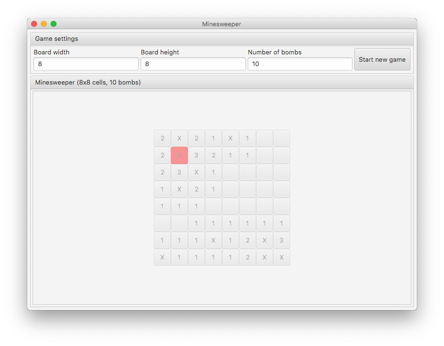

# Introduction

Minesweeper clone programmed in Java 10 using JavaFX as frontend.

I just wanted to keep practicing and prepare a reference for future experimenrts in other languages.

# TODOs

There are a few final touches still missing, which are:

* Better cell decoration with icons and/or a better color scheme
* Show remaining cells
* Allow for locking suspected mine cells
* Additional tests for game mechanics
